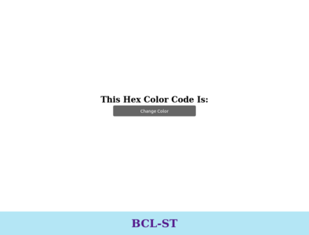
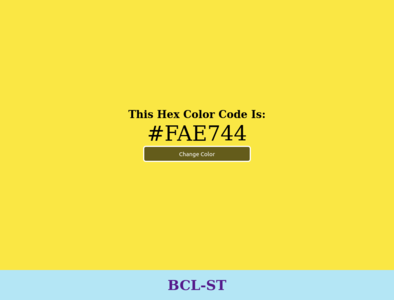
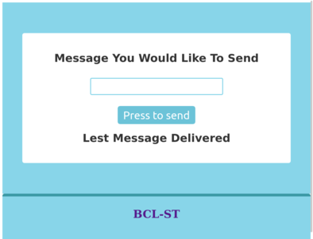
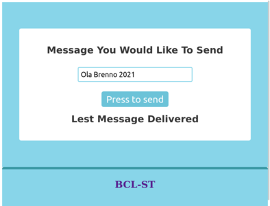
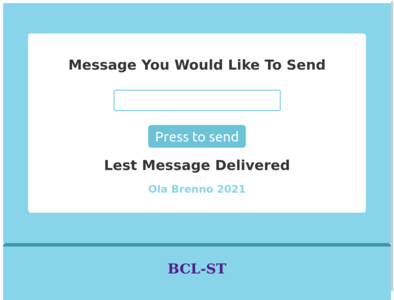
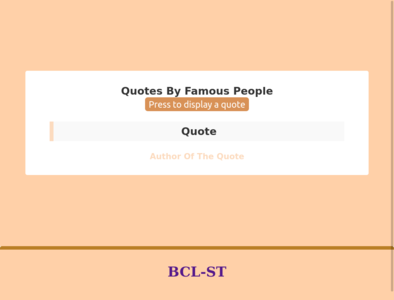
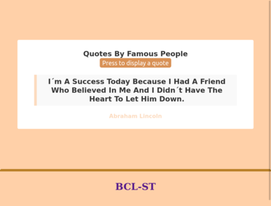
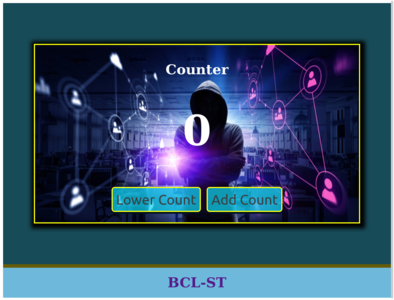
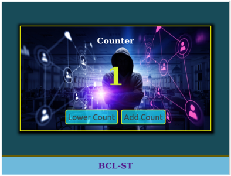
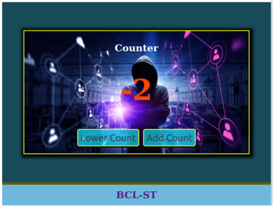

<h4 align="center">
    <br>
    <b>Contagem regressiva! 😍</b>
</h4>
<p align="center">
  <a href="https://www.bcl-st.com.br">
    
  </a>
  
</p>

<br>

# Basic Javascript Projects

Esse é um conjunto de pequenos projetos usando HTML, CSS, e JAVASCRIPT


Autor: `Brenno - BCL-ST`


---

## Captura de tela

 

 

  




### Tecnologias usadas

Este projeto foi desenvolvido com as seguintes tecnologias:

- [HTML](https://developer.mozilla.org/pt-BR/docs/Web/HTML)
- [CSS](https://developer.mozilla.org/pt-BR/docs/Web/CSS)
- [JavaScript](https://developer.mozilla.org/pt-BR/docs/Web/JavaScript)
- [Git](https://git-scm.com/)


#### Esse simples projeto nos ensina:

- Usar o JavaScript para tornar nossas páginas web mais dinamicas
- Estilização usando CSS
- Aplicar conceitos básicos de HTML na criação de um app web

### Instalação

```js
git clone https://github.com/brennoclins/bcl-st_basic-javascript-projects.git

cd countdown-timer

code .
```

OBS.: Escolha um projeto e abra o arquivo `index.html` em seu navegador favorito e divirta-se :)

### Como contribuir

- Fork esse repositório;
- Crie uma branch com a sua feature: `git checkout -b meu-cronometro`
- Commit suas mudanças: `git commit -m 'feat: Minha nova funcionalidade'`
- Push a sua branch: `git push origin meu-cronometro`


### Links:

- [BCL-ST](https://www.bcl-st.com.br)
- [DevMeditation](https://www.instagram.com/devmeditation/)

---

Feito com 😍 Brenno Dev 😍

